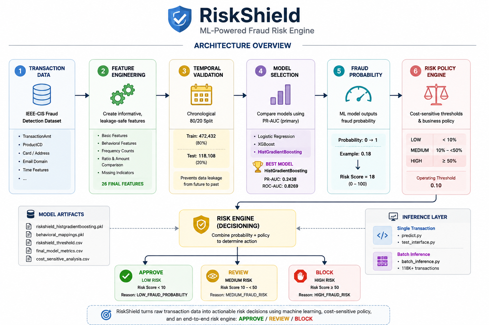

# RiskShield
RiskShield — An end-to-end fraud risk engine using temporal validation, leakage-safe behavioral features, PR-AUC-driven model selection, cost-sensitive threshold optimization, and policy-based decisioning to turn transaction probabilities into actionable APPROVE / REVIEW / BLOCK decisions.

